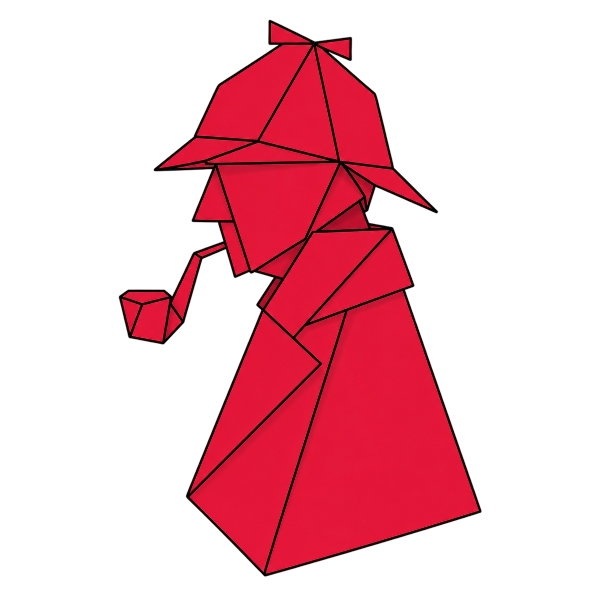

<p align="center">
  
</p>

# Sherlock — a theory-of-mind knowledge graph

Turning the Sherlock Holmes canon into a graph a character can reason over —
so you can ask Watson what he makes of a case and get an answer grounded in
the page you're actually on. No omniscience, no spoilers, no vector search;
just graph traversal filtered by character and time.

This repo is the working code behind a series of articles on
[alexvarden.co.uk](https://alexvarden.co.uk). It argues a point about
retrieval: for anything with **time and perspective** — narrative,
transcripts, conversations — a graph beats vector similarity.

## The idea

Every story is processed into three layers:

1. **Lexical** — the raw text, sentence by sentence.
2. **Objective** — what actually happened (entities, events, places, times).
3. **Character states at runtime** — what each character personally witnessed
   or was told, reconstructed for the page you're on.

A character can only answer from layer 3 — what *they* know — so Watson and
Holmes give genuinely different, spoiler-safe answers from the same scene.

The source text is Arthur Conan Doyle's canon, which is in the public domain.

## What's in here

- `/graph` — knowledge-graph viewer (D3 force graph, timeline scrubber,
  character-perspective filter, live Cypher).
- `/demo` — character Q&A via graph traversal (no embeddings).
- `/read` — a perspective-aware reader: talk to the book as you go.
- `/the-game-is-afoot` — the first article with its embedded, interactive widgets.
- `scripts/` — the ingest pipeline (lexical → objective) and the Neo4j migration.

## Running it locally

You'll need Node, Docker (for Neo4j), and your own OpenAI key (used only at
ingest time, not for retrieval).

```bash
cp .env.example .env      # then fill in your values
docker compose up -d      # starts Neo4j
npm install
npm run dev               # http://localhost:3000
```

Full setup, the three-layer architecture, and how to ingest a new story:

- [`docs/setup.md`](docs/setup.md) — prerequisites, env vars, running locally
- [`docs/architecture.md`](docs/architecture.md) — three-layer design, Neo4j schema, query flow
- [`docs/ingest-architecture.md`](docs/ingest-architecture.md) — the ingestion pipeline
- [`docs/adding-a-story.md`](docs/adding-a-story.md) — ingesting a new story

## Licence

MIT — see [`LICENSE`](LICENSE). The Doyle source text is public domain.
